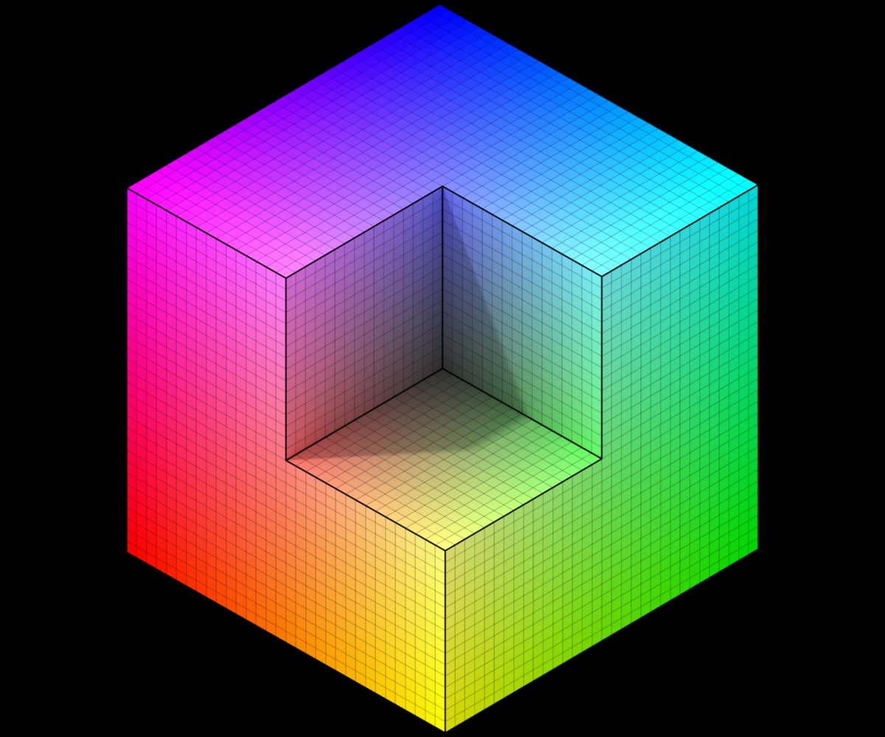

# `.xraw`

XRAW format is simply: a header + a 3d index array + a palette array.
For 16-bit xraw format, just set num bits of index to 16, use 32768 palette, and ~0 for empty voxels.

[It seemed](https://twitter.com/ephtracy/status/687051581859168256) the editor can support either import/export of 8-bit version for `.xraw` format ("*Type `o xraw` in MagicaVoxel command line to export volume data as .xraw file*" - [here](https://github.com/hiroakioishi/VoxelizeMagicaVoxelXRawData)); 16-bit version is for the standalone viewer.

Notice for multi-byte values, it's in **little-endian**. For instance, byte sequence `2000 0000` stands for *32*, and `0080 0000` stands for *32768*.

Notice depends on field value for "**bits per index**" (and maybe **num of palette colors**), the convention for color index reference in Voxel buffer is different! See detailed explanations in examples below.




**Example**

Above picture's (a 32 by 32 cube with a 16 by 16 corner off) binary file is shown below in HEX, where text after `#` denote comment ([rgb555_max_palette.xraw](../examples/rgb555_max_palette.xraw)):

```
# Header
# Magic Number "XRAW" (4 seperate bytes)
5852 4157 
# Meta Data for color palette (4 seperate bytes)
00 # Color channel data type (unsigned integer, signed integer, float)
04 # Number of color channels (RGBA, RGB, RG, R)
08 # Bits per channel (8, 16, 32)
10 # Bits per index (256 color, 32768 colors, no palette) - why using unsigned integer gives only 32768 colors per index? Probably because it's the next smallest size that can hold that many values.
# Width X (32-bit integer)
2000 0000 
# Length Y (32-bit integer)
2000 0000
# Depth/Height Z (32-bit integer)
2000 0000
# Number of palette colors (32 bit integer; 256 or 32768) - shouldn't this always be the same as "Bits per index"? Unless this parameter is only used when "Bits per index" is "no palette"; But still it's not needed since "Bits per channel" and "Number of color channels" is already given.
0080 0000

# Voxel Buffer using Indices (not sure format for voxel buffer without indices): width first, then length, then depth
# First location color (16-bit integer)
(Color index ) # A value of 0 denote first color, a value of 32767/0xFF7F denote last value, anything beyond 32767 denote empty
# ...

# Palette Buffer (starts at 65560 or 0x10018)
# First color (4 seperate bytes) - First color (index 0) is not referentiable so not used because it's reserved to mean empty
(R) (G) (B) (A)
# Second color (4 seperate bytes) - Index 1
(R) (G) (B) (A)
# ...
# Ends at 196632 or 0x30010, fullfilling a total of 32768 color definitions
```

A example of no color palette ([basic_no_palette.xraw](../examples/basic_no_palette.xraw)):

```
# Header
# Magic Number
5852 4157
# Color Meta: unsigned RGBA 8-bit no palette
00 04 08 00
# Size: 2x2x1 - 256 Colors
02000000
02000000
01000000
00010000

# Voxel Buffer (Currently this format is not working, cannot guess the binary layout for this section in this circumstance)
# First width row
FFFFFFAA FFFFFFFF
# Second width row
000000AA 000000FF

# No Palette
```

An example of 256 color palette ([simple_256_palette.xraw](../examples/basic_no_palette.xraw)):

```
# Header
# Magic Number
5852 4157
# Color Meta: unsigned RGBA 8-bit 256-color palette
00 04 08 08
# Size: 2x2x1 - 256 Colors
02000000
02000000
01000000
00010000

# Voxel Buffer: Every voxel is 8 bits (1 byte)
# First width row
# (Color index + 1) # A value of 0 denote empty, so color index is offset by 1; A value of 1 denote the second color; A value of 255 denote last color.
0100
# Second width row
0100

# 256 Palette
000000FF
000001FF
000002FF
000003FF
000004FF
000005FF
000006FF
000007FF
000008FF
000009FF
00000AFF
00000BFF
00000CFF
00000DFF
00000EFF
00000FFF
000010FF
000011FF
000012FF
000013FF
000014FF
000015FF
000016FF
000017FF
000018FF
000019FF
00001AFF
00001BFF
00001CFF
00001DFF
00001EFF
00001FFF
000020FF
000021FF
000022FF
000023FF
000024FF
000025FF
000026FF
000027FF
000028FF
000029FF
00002AFF
00002BFF
00002CFF
00002DFF
00002EFF
00002FFF
000030FF
000031FF
000032FF
000033FF
000034FF
000035FF
000036FF
000037FF
000038FF
000039FF
00003AFF
00003BFF
00003CFF
00003DFF
00003EFF
00003FFF
000040FF
000041FF
000042FF
000043FF
000044FF
000045FF
000046FF
000047FF
000048FF
000049FF
00004AFF
00004BFF
00004CFF
00004DFF
00004EFF
00004FFF
000050FF
000051FF
000052FF
000053FF
000054FF
000055FF
000056FF
000057FF
000058FF
000059FF
00005AFF
00005BFF
00005CFF
00005DFF
00005EFF
00005FFF
000060FF
000061FF
000062FF
000063FF
000064FF
000065FF
000066FF
000067FF
000068FF
000069FF
00006AFF
00006BFF
00006CFF
00006DFF
00006EFF
00006FFF
000070FF
000071FF
000072FF
000073FF
000074FF
000075FF
000076FF
000077FF
000078FF
000079FF
00007AFF
00007BFF
00007CFF
00007DFF
00007EFF
00007FFF
000080FF
000081FF
000082FF
000083FF
000084FF
000085FF
000086FF
000087FF
000088FF
000089FF
00008AFF
00008BFF
00008CFF
00008DFF
00008EFF
00008FFF
000090FF
000091FF
000092FF
000093FF
000094FF
000095FF
000096FF
000097FF
000098FF
000099FF
00009AFF
00009BFF
00009CFF
00009DFF
00009EFF
00009FFF
0000A0FF
0000A1FF
0000A2FF
0000A3FF
0000A4FF
0000A5FF
0000A6FF
0000A7FF
0000A8FF
0000A9FF
0000AAFF
0000ABFF
0000ACFF
0000ADFF
0000AEFF
0000AFFF
0000B0FF
0000B1FF
0000B2FF
0000B3FF
0000B4FF
0000B5FF
0000B6FF
0000B7FF
0000B8FF
0000B9FF
0000BAFF
0000BBFF
0000BCFF
0000BDFF
0000BEFF
0000BFFF
0000C0FF
0000C1FF
0000C2FF
0000C3FF
0000C4FF
0000C5FF
0000C6FF
0000C7FF
0000C8FF
0000C9FF
0000CAFF
0000CBFF
0000CCFF
0000CDFF
0000CEFF
0000CFFF
0000D0FF
0000D1FF
0000D2FF
0000D3FF
0000D4FF
0000D5FF
0000D6FF
0000D7FF
0000D8FF
0000D9FF
0000DAFF
0000DBFF
0000DCFF
0000DDFF
0000DEFF
0000DFFF
0000E0FF
0000E1FF
0000E2FF
0000E3FF
0000E4FF
0000E5FF
0000E6FF
0000E7FF
0000E8FF
0000E9FF
0000EAFF
0000EBFF
0000ECFF
0000EDFF
0000EEFF
0000EFFF
0000F0FF
0000F1FF
0000F2FF
0000F3FF
0000F4FF
0000F5FF
0000F6FF
0000F7FF
0000F8FF
0000F9FF
0000FAFF
0000FBFF
0000FCFF
0000FDFF
0000FEFF
0000FFFF
```